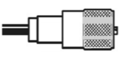

# MOCK TEST 1 — ANSWERS

## Question 1 — C

The three UK Amateur Radio licence levels are Foundation, Intermediate and Full.

## Question 2 — A

You are required to give your callsign when you start transmitting on a new frequency - people monitoring/using that new frequency need to know who you are, and you must be clearly identifiable.

## Question 3 — A

A 'Net' or 'Network' refers to transmissions to three or more amateurs with whom communication and identification have been established.

## Question 4 — B

The licence states: "A person authorised by Ofcom may require the Radio Equipment, or any part thereof, to be modified or restricted in use, or temporarily or permanently closed down immediately"

## Question 5 — D

Refer to the 'Foundation Licence Parameters' table in the 4-page exam booklet. Look for the entry "10100-10150kHz" on page 2 (8 lines down). You will see that this is 'Secondary' and limited to 25 Watts.

## Question 6 — A

Restrictions apply for signals radiated at 10 Watts EIRP and above (6.1 Watts ERP) to ensure that members of the public are not exposed to high Electromagnetic field (EMF) limits.

## Question 7 — C

A conductor allows electrons to flow easily, and an insulator does not. Copper and brass are good conductors, as is carbon. Insulators include plastics, rubber, glass and ceramics.

## Question 8 — B

HF bands are defined as being between 3MHz and 30MHz, so 14.070MHz is the only one in the HF range.

## Question 9 — D

An Analogue to Digital Converter (ADC) is a device used to sample an analogue signal and produce a digital representation of it.

## Question 10 — B

Modulation is defined as the process of adding information to a radio frequency carrier. It may help to remember this as the process of mixing audio and RF into a radio signal.

## Question 11 — B

Too strong an audio signal can cause a signal to overdeviate and interfere with neighbouring channels.

## Question 12 — C

A detector removes the carrier, leaving the audio signal

## Question 13 — C

A balun connects a BALanced antenna (dipole) to UNbalanced coaxial feeder.

## Question 14 — A

An antenna (when transmitting) converts electrical signals created by the transmitter into radio waves sent out by the antenna.

When receiving, an antenna converts radio waves captured by the antenna, and converts them to electrical signals that can be accessed by a radio receiver.

## Question 15 — C

The PL-259 plug is a common RF connector, usually associated with HF operation. Compared to the 'N'-type plug, this has a protruding centre pin.

## Question 16 — B

Layers of conductive gases that are between 70 and 400km above the Earth are known as the ionosphere.

## Question 17 — C

VHF signals typically travel just beyond the line of sight, hence the need for high transmitter sites for broadcast radio stations.

## Question 18 — B

If you're not transmitting, that's a clear sign that something else is causing interference to the TV.

## Question 19 — C

End-fed long wire antennas are unbalanced and often of a random length, so they are most likely to cause EMC problems.

## Question 20 — A

To get advice on not causing undue interference from the RSGB EMC Committee website.

## Question 21 — D

You should use the FM Calling frequency to establish contact with someone, then move elsewhere to chat, to leave the Calling frequency free for other users. Chatting about the weather on that channel stops other users from being able to put out calls.

## Question 22 — C

Refer carefully to the 2m band plan in the 4-page exam booklet on page 3. Check each frequency. Look about halfway down the table for 144.8000MHz "Unconnected Nets - APRS UIView, etc"

## Question 23 — A

PTT stands for "Push to talk" (when you press the transmit key on a microphone). You need to make sure that your computer does not use PTT to enable the transmitter by accident, otherwise your computer may put your radio into "transmit" without your knowledge.

## Question 24 — B

The blue wire inside a UK mains plug is the 'neutral'. Brown is 'live', and green/yellow is for the 'earth'.

## Question 25 — A

With ladders, for every 4 units up, you need to have 1 unit along. For example, a ladder 4 metres up a wall should have its base 1 metre from the wall.

## Question 26 — C

Antenna elements and other conductors carrying RF should not be touched whilst transmitting, due to the risk of RF burns to the skin.
