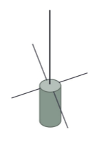

# MOCK TEST 2

## Question 1

Ofcom requires you to revalidate your licence - How often?

- A. At least once every 5 years
- B. From time to time
- C. When changing your Main Station Address
- D. Annually

## Question 2

Your licence requires you to ensure that your station is clearly identifiable. Which of the following is the recommended practice for giving your callsign?

- A. At least once every 15 minutes
- B. When first transmitting on a frequency and as frequently as practicable
- C. At least once per transmission
- D. When transmitting on a new frequency and when leaving a frequency

## Question 3

You hold a Foundation callsign M7QQQ. You are visited by M0ABC, who wants to use your radio with their callsign at 25 Watts. You're happy for them to use your radio, but what is the licence position?

- A. They can use the callsign M0ABC under the terms of their licence
- B. They can use the callsign M0ABC at 25 Watts, but only under your direct supervision
- C. They can't use M0ABC, but can use M7QQQ at 25 Watts
- D. The amateur radio licence does not allow this

## Question 4

When are you required to keep a log of transmissions?

- A. If requested by a neighbour
- B. If requested by anyone from Ofcom
- C. After testing or modifying your station equipment
- D. When operating at a /P Temporary location

## Question 5

When can a Foundation licence holder **not** use 14.275MHz?

- A. To communicate with an amateur satellite
- B. To communicate with an amateur overseas
- C. Within 100km of Charing Cross in London
- D. Only when adjacent frequencies are not in use by the Primary user

## Question 6

The amateur radio licence includes a section on EMF. To what does this relate?

- A. Ensuring that signals do not cause interference to nearby electrical devices
- B. Connecting amateur radio equipment to a suitable RF earthing system
- C. Not exposing members of the public to electromagnetic fields that exceed set limits
- D. Making contact on internationally-agreed frequencies

## Question 7

What is the formula for calculating power?

- A. V x I
- B. I x R
- C. I / V
- D. I / R

## Question 8

What is the relationship between frequency and wavelength?

- A. Frequency and wavelength are equal
- B. As the frequency increases, the wavelength increases
- C. As the frequency increases, the wavelength decreases
- D. The wavelength reduces at lower frequencies

## Question 9

What best defines analogue signals?

- A. Signals resulting from an ADC conversion
- B. A stream of signals of finite values at a specific sampling interval
- C. Signals changing in amplitude and/or frequency
- D. Signals produced by a computing device

## Question 10

What does the following diagram represent?

- A. Demodulated AM signal
- B. Demodulated FM signal
- C. Voice and carrier modulated by frequency
- D. Voice and carrier modulated by amplitude

## Question 11

A transmitter's RF power amplifier should be

- A. Connected to the output of the demodulator
- B. Tuned to the precise transmit frequency
- C. Connected to a correctly matched antenna
- D. Adjusted using the squelch control

## Question 12

What is the name given to a device designed to recover information sent from one place to another using electromagnetic radiation?

- A. A radio receiver
- B. A modulator
- C. A DAC
- D. An RF power amplifier

## Question 13

What type of feeder is unbalanced with the signal on the centre conductor surrounded by a screen?

- A. Coaxial cable
- B. Twin-feeder
- C. Waveguide
- D. SMA

## Question 14

What type of antenna is this?

- A. Vertical dipole
- B. 5/8 wavelength vertical
- C. 1/4 wavelength ground plane vertical
- D. Vertically-polarised Yagi

## Question 15

After tuning your radio to a new frequency, you check the SWR of your end-fed long wire antenna. You see an SWR of 4:1. What is the most appropriate action?

- A. The antenna should not be used
- B. You should replace the balun
- C. An AMU should be used to match the antenna
- D. The antenna should only be used at low power to prevent damage to the transmitter

## Question 16

Which is most critical when trying to make a contact outside of Europe from the UK?

- A. Time of day
- B. Day of week
- C. Transmitter power
- D. Good local weather conditions

## Question 17

What is "Atmospheric Ducting"?

- A. A type of feeder used at microwave frequencies that is dangerous to look down
- B. A layer of gas that helps HF to propagate around the world
- C. A condition that may extend the range of VHF and UHF signals
- D. A method of contacting amateur satellites on lower HF frequencies

## Question 18

Which item is most likely to be affected by signals from a nearby radio transmitter?

- A. A wired home doorbell
- B. An electronic calculator
- C. A cordless drill
- D. A domestic radio receiver

## Question 19

Which of the following modulation types is least likely to cause EMC issues?

- A. AM
- B. FM
- C. SSB
- D. FT8 data mode

## Question 20

Your neighbour complains that your amateur radio antenna is interfering with his Freeview TV signal. What should you do?

- A. Show him a copy of your licence to prove that you are allowed to transmit
- B. Speak to your council planning officer
- C. Offer to log your transmissions for comparison
- D. Ask him to buy you an RF filter

## Question 21

Which of the following is correct for the callsign MM7QQQ/P?

- A. The station is operating from a temporary location
- B. This is a UK Full licence holder
- C. The operator is on the Isle of Man
- D. The operator is mobile in Scotland

## Question 22

Which of the following frequencies is allocated to Land Mobile?

- A. 136.5MHz
- B. 158.6MHz
- C. 144.5MHz
- D. 150.6MHz

## Question 23

Why can a Foundation licence holder not operate overseas?

- A. Ofcom will not know your overseas address to contact you
- B. Due to radio import/export restrictions
- C. Administrations in other countries do not routinely recognise the Foundation licence
- D. The risk of interference to non-UK equipment

## Question 24

For safety reasons, what is recommended for your home amateur radio setup?

- A. A non-slip floor or floor mat
- B. Correctly screened feeder cables
- C. A clearly-marked 'Off' switch for your equipment
- D. A powder-based fire extinguisher

## Question 25

Soldering workstations must be well-ventilated. Why is this?

- A. To avoid inhalation of solder fumes, which can cause breathing problems
- B. To keep the soldering iron cool
- C. To ensure solder splashes blow away
- D. To improve visibility

## Question 26

Where should antenna elements and other conductors carrying RF be sited?

- A. A quarter of a wavelength above the ground
- B. As close to the transmitter as possible
- C. Where they can be easily accessed for maintenance
- D. Where people will not come into accidental contact with them
