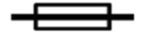

# MOCK TEST 3

## Question 1

In a UK callsign, where does the regional secondary identifier "M" indicate?

- A. England
- B. Wales
- C. Isle of Man
- D. Scotland

## Question 2

You change modes from FM to SSB and start transmitting. What are you required to do?

- A. Note the change in your logbook
- B. Give your callsign
- C. Check your SWR
- D. Transmit a CTCSS tone

## Question 3

Transmitting messages for "general reception" is:

- A. Not permitted
- B. Not permitted, except for CQ calls and 'nets
- C. Permitted within the UK only
- D. Permitted for Primary users only

## Question 4

Under which of these circumstances does Ofcom have the right to close down your amateur radio station?

- A. You have not transmitted in over a year
- B. You operate from a location other than your home address
- C. You use a mode other than voice
- D. You are in breach of your licence conditions

## Question 5

Which of the following frequencies can a Foundation licence holder transmit on?

- A. 7.007MHz
- B. 10.155MHz
- C. 21.475MHz
- D. 24.880MHz

## Question 6

Under the EMF section of the licence, at what power level do electromagnetic field restrictions apply?

- A. 5 Watts ERP
- B. 5 Watts EIRP
- C. 10 Watts ERP
- D. 10 Watts EIRP

## Question 7

What does this electrical symbol represent?

- A. Resistor
- B. Switch
- C. Bulb / Lamp
- D. Fuse

## Question 8

What would best describe a 12-volt car battery?

- A. Primary AC
- B. Primary DC
- C. Secondary AC
- D. Secondary DC

## Question 9

What is required to process digital signals?

- A. A modulator
- B. A tuning and audio stage
- C. A computing device
- D. A balun

## Question 10

If you were calling at 10 Watts on 14.300MHz, which mode would be the **most** efficient and appropriate?

- A. AM
- B. LSB
- C. USB
- D. Any of the above

## Question 11

Another station reports that your signal is distorting. What do you do?

- A. Adjust the microphone gain
- B. Alter the mode of modulation
- C. Check the antenna connection
- D. Increase the frequency deviation

## Question 12

In a basic analogue radio receiver, after the signal has been demodulated, what happens next?

- A. The RF amplifier boosts the received radio signal, ready for processing
- B. The audio amplifier stage boosts the signal so that it is loud enough to drive the speaker
- C. The A-to-D stage converts the audio to digital
- D. The user tunes to the required frequency of the signal

## Question 13

Radio amateurs tend to use thicker, low-loss coaxial feeder for VHF and UHF antennas than for HF antennas. Why is this?

- A. Feeder loss increases with frequency
- B. It's generally less expensive
- C. The antennas are usually horizontal
- D. Antennas are generally longer than HF

## Question 14

I have a Yagi with a gain of 3dB. If I transmit 10 Watts into that antenna, what is my ERP?

- A. 10 Watts
- B. 20 Watts
- C. 30 Watts
- D. 33 Watts

## Question 15

You are operating on the 20-metre band, and you change to the 40-metre band. When you try to transmit on this new band, your transmitter shows a "high SWR" warning. What is the likely problem?

- A. A fault with your transmitter
- B. There is an antenna mismatch
- C. Your transmitter is transmitting too much power
- D. There is too much loss in your feeder cable

## Question 16

Which of the following best describes the function of the Ionosphere for amateur radio?

- A. It reflects VHF and UHF signals, helping signals bounce around the Earth
- B. It amplifies and reflects radio energy
- C. It refracts HF signals back down to Earth
- D. It helps to reduce interference to weak AM signals

## Question 17

Which of the following is more likely to attenuate (reduce) the range of UHF signals?

- A. Snow and Ice
- B. The time of day
- C. Skywave propagation
- D. Tropospheric ducting

## Question 18

Amateur radio signals are least likely to interfere with what?

- A. A microwave oven
- B. A CCTV camera
- C. A wi-fi router
- D. A computer monitor

## Question 19

Which of the following would be the best RF earth to connect to?

- A. The green/yellow wire in a mains plug
- B. A copper pipe on the closest radiator to the shack
- C. A one-meter length of copper pipe hammered into the ground
- D. A copper wire running horizontally just below the grass, from the feed point of your antenna

## Question 20

You're in dispute with your neighbour about possible interference. Which of the following are worth considering?

- A. Logging times of transmissions to confirm you're the cause
- B. Making changes to your setup and conducting tests
- C. Getting EMC advice from the RSGB
- D. All of the above

## Question 21

When tuning to a new frequency, you listen, and it seems quiet. Why is it important to ask "Is this frequency in use?"

- A. Some amateurs have their own private channels reserved for personal use
- B. It is part of your licence conditions
- C. The frequency may be in use, with one of the two stations too far away for you to hear
- D. Someone with a Full licence may have reserved the frequency, and Full licence holders get priority

## Question 22

On which frequency can a Foundation licence holder transmit voice?

- A. 14.285MHz
- B. 14.100MHz
- C. 144.500MHz
- D. 145.725MHz

## Question 23

Regarding Digital Voice (DV), which statement is most accurate?

- A. DV uses its own different band plan
- B. You do not need to transmit a callsign, as transmissions are digital
- C. You must use the correct CTCSS tone to access a digital repeater
- D. There are several formats that may not be compatible

## Question 24

What safety device has a wire designed to melt if an excessive current flows through it?

- A. Breaker
- B. RCBO
- C. Fuse
- D. Earth

## Question 25

Eye protection should be worn when drilling in order to

- A. Hold your glasses (if worn) in place
- B. Prevent swarf from entering your eyes
- C. Allow closer inspection of the work
- D. Protect your employer's safety record

## Question 26

Antennas or ladders coming into contact with overhead lines can be lethal. A related risk is what?

- A. Attracting arcing
- B. RF radiation exposure
- C. Swarf
- D. Exposure to UV energy
