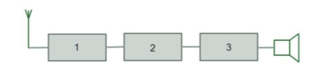

# MOCK TEST 4

## Question 1

Which of the following is not a type of amateur radio licence?

- A. Intermediate
- B. Beginner
- C. Foundation
- D. Full

## Question 2

You are operating voice-mode on 2m. You change modes and send an SSTV (slow scan TV) image. What are you required to do by your licence?

- A. Notify Ofcom
- B. Change your callsign suffix
- C. Log the change of mode
- D. Transmit your callsign

## Question 3

The operator of a station who contacts you does not give their callsign, even when asked more than once. What action should be taken?

- A. Report the incident to Ofcom
- B. Keep asking for the callsign
- C. Terminate the contact
- D. Note the contact in your log

## Question 4

As a licensed radio amateur, the licence requires you

- A. Not to offend other radio amateurs
- B. Not to operate on inland waterways
- C. Not to cause undue interference
- D. Not to breach local planning laws

## Question 5

Ofcom imposes a limit on the effective radiated power of only one of the following frequencies. Which is it?

- A. 51.99MHz
- B. 10.110MHz
- C. 430.900MHz
- D. 439.300MHz

## Question 6

What do you need to do to comply with the EMF requirements in the amateur radio licence?

- A. Keep a record of your EMF assessments
- B. Notify Ofcom of any change to your station equipment and/or antennas
- C. Perform emissions tests from time to time
- D. Never transmit if members of the general public are nearby

## Question 7

The units used to measure Potential Difference, Current, and Resistance are:

- A. Watts, Volts and Amps
- B. Volts, Amps and Ohms
- C. Hertz, Volts and Ohms
- D. Ohms, Volts and Watts

## Question 8

Which of the following most closely matches the normal range of human hearing?

- A. 20Hz to 15kHz
- B. 300Hz to 3kHz
- C. 3MHz to 30MHz
- D. 30MHz to 300MHz

## Question 9

What does a DAC do?

- A. It represents a digital signal in an analogue format
- B. It samples an analogue signal and produces a digital representation of it.
- C. It converts Direct Current to Alternating Current
- D. It creates a Digital Audio Carrier Wave

## Question 10

Which of the following is not a type of modulation?

- A. AM
- B. FM
- C. HF
- D. USB

## Question 11

In a basic voice transmitter, the frequency of the transmitted signal is determined by what?

- A. The A-to-D converter
- B. The carrier oscillator
- C. The modulator
- D. The power amplifier

## Question 12

In this diagram, what is the purpose of Box 1?

- A. Tuning and RF amplification
- B. Removal of the carrier
- C. Amplification of the audio
- D. Digital to Analogue conversion

## Question 13

Which statement is FALSE with respect to feeder?

- A. Some RF energy is converted to heat
- B. Feeder loss increases with frequency
- C. A low-loss feeder should be used at VHF and UHF
- D. Coaxial cable carries the signal on the feeder's screen

## Question 14

If the feed point impedance of the antenna does not match that of the feeder, what happens?

- A. Energy will be reflected down the feeder
- B. The SWR at the transmitter may be too low for safe use
- C. Energy may leak out at the feed point
- D. The antenna may become damaged

## Question 15

On a PL-259 plug, the braid should

- A. Be connected to the inner pin of the plug
- B. Be exactly one-quarter of the antenna's wavelength
- C. Be connected to the chassis (outside part) of the connector
- D. Be made of a suitable insulator

## Question 16

What does it mean if an HF band is referred to as being "open"?

- A. It supports Skywave propagation
- B. The band is available as no one is using it
- C. You can expect Sporadic E and tropospheric ducting
- D. Signals are not refracted by the Ionosphere

## Question 17

What would be the most effective way to extend the range for transmitting and receiving VHF or UHF signals?

- A. Using UHF rather than VHF
- B. Using an indoor antenna
- C. Increasing the transmitter power
- D. Increasing the height of the antenna

## Question 18

Your TV's surround sound system is getting interference from local taxis... where could this be coming from?

- A. The surround sound amplifier
- B. The loudspeaker leads
- C. The cabling from your TV to the sound system
- D. Any of the above

## Question 19

What is meant by the phrase 'electromagnetic compatibility'?

- A. The avoidance of interference between items of electronic equipment
- B. Matching transmit and receive frequencies correctly
- C. The ability of a piece of equipment to withstand interference
- D. Reducing SWR to prevent transmitter damage

## Question 20

EMC problems have the potential to cause what?

- A. Neighbour disputes
- B. High SWR
- C. Voiding of equipment warranty
- D. Damage to the antenna from high current

## Question 21

If you call CQ, and someone responds with inappropriate language, what should you do?

- A. Ask the offender to watch their language, as children may be listening
- B. Advise the offender that you will report them to Ofcom
- C. Ignore the offender and do not refer to hearing them
- D. Reply in an equally offensive way

## Question 22

Which of the following best describes the role of a repeater?

- A. To amplify received signals
- B. To forward on messages to other amateurs
- C. To allow you to repeat messages you've missed
- D. To increase the range that a mobile station can reach

## Question 23

When giving a signal report, what is the recommended amateur radio format for exchanging reports?

- A. Readability, Signal Strength and Tone
- B. Received Signal Strength, Station and Time
- C. Received Strength, Sound Quality and Type
- D. Reception, Smoothness and Text

## Question 24

Thinking about amateur radio safety, what is the main risk associated with high current?

- A. Electrocution
- B. Fire
- C. Earth fault
- D. RF burns

## Question 25

When working at height, you should wear...?

- A. Ear protectors
- B. Safety goggles
- C. A hard hat
- D. A hi-viz jacket

## Question 26

What is the main health risk resulting from exposure to electromagnetic radiation?

- A. Risk of electrocution
- B. Heating of body tissue
- C. Breathing problems
- D. Disorientation
