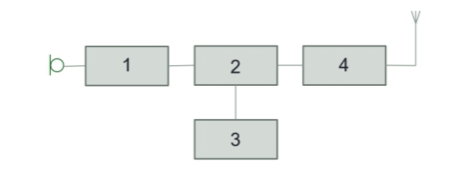

# MOCK TEST 5

## Question 1

Which of the following is **not** permitted by the amateur radio licence?

- A. Talking about the weather
- B. Discussing the makes and models of radios
- C. Advertising prices of your home-made antennas
- D. Use of codes

## Question 2

If you are transmitting using a data mode, what are the requirements regarding giving your callsign?

- A. You must speak your callsign before starting to send data
- B. The callsign must be sent before you start transmitting
- C. The callsign must be sent in the appropriate format
- D. Your callsign must be given at the end of the data contact

## Question 3

Driving home, you encounter a traffic jam. To help other amateurs, you want to warn them about the problem. Do you...

- A. Announce the problem to amateurs on the local repeater
- B. Go to a VHF frequency used for local information and announce the problem to amateurs who may be listening
- C. Call CQ on 145.500MHz and announce the problem to amateurs
- D. None of the above

## Question 4

A neighbour believes that you are causing interference. What may you be required to do?

- A. Keep a log of your transmissions
- B. Make changes to your station setup
- C. Restrict how you operate
- D. Any of the above

## Question 5

Which of the following statements is **TRUE** for the frequency 3.790MHz?

- A. It is shared with other services
- B. It is a secondary allocation
- C. It is available for satellite communications use
- D. It cannot be used within 100km of Charing Cross

## Question 6

The amateur radio licence requires you to do what in relation to EMF?

- A. Not transmit high satts [sic] EIRP
- B. Not expose members of the public to any electromagnetic fields
- C. Stay below international EMF limits
- D. Stay below international EMF limits and keep a record of compliance assessments

## Question 7

How could 5mΩ also be written?

- A. 5,000,000 Ohms
- B. 0.005 Ohms
- C. 0.000005 Ohms
- D. 0.00005 Ohms

## Question 8

Which unit symbol is used to measure wavelength?

- A. Hz
- B. W
- C. M
- D. m

## Question 9

What does ADC stand for?

- A. Analogue to Digital Conversion
- B. Amplitude Digital Compression
- C. Amps and Direct Current
- D. Antenna Direct Coupling

## Question 10

Which of the following parts of a transmitter defines the frequency at which the transmitter operates?

- A. The oscillator
- B. RF power amplifier
- C. RF tuning and amplification stage
- D. RF modulator

## Question 11

In the following diagram, what function is performed by Box 3?

- A. RF Power Amplifier
- B. Audio Stage
- C. Oscillator
- D. Modulator

## Question 12

What part of a receiver recovers audio from a modulated signal?

- A. The Detector
- B. The Audio Stage
- C. The Oscillator
- D. The Modulator

## Question 13

Why is coaxial cable widely used as feeder?

- A. It is balanced
- B. It is a good insulator
- C. It is screened
- D. It has an impedance of 500 ohms

## Question 14

What is EIRP?

- A. Antenna gain expressed relative to a theoretical antenna
- B. Antenna gain expressed relative to a half-wave dipole
- C. Antenna gain expressed relative to an end-fed long-wire
- D. Antenna gain expressed relative to a dummy load

## Question 15

If your antenna is not a perfect "match", some of the power sent from the transmitter will be reflected back to the transmitter. These are known as what?

- A. Carrier Waves
- B. Modulation Waves
- C. Amplitude Waves
- D. Standing Waves

## Question 16

Where is the Ionosphere?

- A. 40-70km above the surface of the Earth
- B. 400-700km above the surface of the Earth
- C. 70-400km above the surface of the Earth
- D. 70-4000km above the surface of the Earth

## Question 17

Which layer can help with extending the range of VHF and UHF signals?

- A. The Stratosphere
- B. The Atmosphere
- C. The Ionosphere
- D. The Troposphere

## Question 18

What is meant by a piece of equipment's "immunity"?

- A. Its ability to work in the presence of strong RF
- B. Having its metal parts connected to Earth in case of a short
- C. Its ability to stop radio signals from radiating outwards
- D. Its ability not to cause unwanted interference to nearby devices

## Question 19

What is the function of the RF earth?

- A. To protect against lightning strikes damaging your equipment
- B. To prevent an electric shock in the event of a fault
- C. To provide a path to ground and minimise RF getting into the mains earth
- D. To act as a ground plane for an HF antenna

## Question 20

If a neighbour complains that you may be causing interference to his/her TV, which of the following options is recommended?

- A. Ask your neighbour to contact Ofcom
- B. Show your neighbour your current valid Ofcom licence
- C. Get some advice from the RSGB EMC committee
- D. Wait until they have finished watching TV before transmitting again

## Question 21

You want to transmit using a data mode, perhaps to send an image, but you don't know which frequency is the best one to use. What should you look for on the band plan?

- A. Any "all modes" frequency
- B. The Centre of Activity for the mode in question
- C. A beacon frequency
- D. The 'Random MS' frequency

## Question 22

What is CTCSS?

- A. A data mode
- B. A code used by radios when accessing an analogue repeater
- C. The offset between input and output frequencies on a repeater
- D. The organisation responsible for band plans

## Question 23

It is recommended that you ask an amateur radio friend to comment on your transmitted audio signal when you start using a new microphone. Why is this?

- A. The transmit frequency might need adjusting
- B. The microphone may be tuned to the wrong band
- C. To prove that it wasn't a waste of money
- D. The microphone gain on the transmitter may need to be re-adjusted

## Question 24

Special care must be taken with what family of batteries?

- A. Nickel-Cadmium
- B. Alkaline
- C. Lithium
- D. Zinc-Carbon

## Question 25

Why is a tool belt important when up a ladder?

- A. It will help to prevent falling objects
- B. It will help with balance and your centre of gravity
- C. It can be used to tether you to the ladder
- D. It makes tools easier to find

## Question 26

On a field day, what is a possible risk?

- A. A member of the public touching an antenna that is transmitting
- B. Trip hazards relating to coaxial cable routing
- C. Short-circuiting a 12V battery
- D. All of the above
