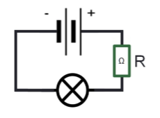

# MOCK TEST 6

## Question 1

Steve MW8QQQ will be visiting a hotel in London and wants to contact M0ABC on 431.500MHz. Which is true?

- A. Steve would operate as M8QQQ/A
- B. Steve would operate as MW8QQQ/P
- C. Steve would operate as MW8QQQ/A
- D. This contact is not permitted

## Question 2

You put a call out on 145.500MHz (the FM calling frequency), make contact with someone, and change to a different frequency to have a chat. When are you required to give your callsign?

- A. When calling on 145.500MHz and when starting on the new frequency
- B. When someone responds to you on 145.500MHz and within the first 5 minutes on the new frequency
- C. When calling on 145.500MHz and before leaving 145.500MHz
- D. When another amateur asks you for your callsign

## Question 3

What does the amateur radio licence say about the use of codes and abbreviations at Foundation?

- A. Not permitted, as they may confuse other radio users
- B. Permitted, as long as they do not obscure or confuse the meaning of the message
- C. Only permitted at times of emergency, on request from a member of the user services
- D. Permitted under the supervision of a full licence-holder only

## Question 4

Any individual authorised by Ofcom has the right to do what?

- A. Close down your amateur radio station
- B. Require that you modify your amateur radio equipment
- C. Restrict the operation of your amateur radio equipment
- D. All of the above

## Question 5

Which of the following frequencies cannot be used in central London?

- A. 70.31MHz
- B. 431.990MHz
- C. 439.990MHz
- D. 430.990MHz

## Question 6

Ofcom requires radio amateurs to keep records of what?

- A. EMF assessments
- B. Contacts outside of the UK
- C. Changes to your station equipment
- D. Operations away from your Main Station Address

## Question 7

This circuit is powered by a 9-volt battery and has a current of 3 amps flowing through it. Assuming that the lamp has no resistance, what is the value of R?

- A. 0.33 ohms
- B. 3 ohms
- C. 30 ohms
- D. 300 ohms

## Question 8

A radio wave has a length of approximately 4 metres. Which of the following would be a valid 4 metre frequency?

- A. 40.3MHz
- B. 70.3MHz
- C. 144.3MHz
- D. 288.3MHz

## Question 9

What could be described as a stream of finite values at a specific sampling frequency?

- A. A parallel circuit
- B. An alternating current
- C. A digital signal
- D. A sine wave

## Question 10

Which of the following is **not** true for FM?

- A. Excessive Frequency Deviation causes interference with adjacent channels
- B. Waveform height varies with the volume of the audio
- C. A carrier needs to be generated by an oscillator
- D. The modulated signal would have varying numbers of waves per second

## Question 11

A transmitter must be connected to a correctly matched antenna system. Use of a mismatched antenna system (with a very poor SWR) runs the risk of damage to what?

- A. The antenna feed point
- B. The feeder
- C. The microphone amplifier
- D. The RF power amplifier

## Question 12

In a Software Defined Radio receiver, what enables all of the radio signals to be sifted into separate frequency components?

- A. The D-to-A converter
- B. The A-to-D converter
- C. The demodulator
- D. A mathematical operation in software

## Question 13

A long length of coaxial feeder cable may exhibit what?

- A. Gain
- B. Loss
- C. Dummy loads
- D. ERP

## Question 14

10 Watts EIRP (Effective Isotropic Radiated Power) is equivalent to what value of ERP?

- A. 1.6W ERP
- B. 6.1W ERP
- C. 16.1W ERP
- D. 11.6W ERP

## Question 15

An antenna correctly connected to a transmitter, but used on the wrong band, could

- A. Damage the antenna
- B. Reduce the SWR on the feeder
- C. Increase the ERP from the antenna
- D. Reflect some of the power back down the feeder

## Question 16

What effect does ultraviolet radiation normally have on propagation?

- A. A negative effect on HF propagation
- B. A positive effect on HF propagation
- C. A negative effect on VHF propagation
- D. A positive effect on VHF propagation

## Question 17

The range that your FM signals can reach on VHF/UHF frequencies is mainly dependent on 4 things - antenna height, antenna gain, transmitter power and what else?

- A. The amount of UV from the sun reaching the Ionosphere
- B. Air quality
- C. Lack of obstructions between the transmit and receive antennas
- D. The amplitude of the modulated waveform

## Question 18

What is the most likely reason that one piece of electrical equipment is more susceptible to interference than another?

- A. It has a lower immunity
- B. It may not have a mains earth connection
- C. It uses AC, not DC voltage
- D. It has not been repaired correctly

## Question 19

You are contacting someone very close to you. Why might you want to reduce your transmitter power?

- A. Less likely to over-modulate
- B. Less likely to cause interference
- C. To save on their battery
- D. Less likely to over-deviate

## Question 20

From an EMC perspective, why might it be useful to keep a log of transmissions?

- A. To prove you are operating within your licence conditions
- B. To have a list of people who can vouch for your contact
- C. In case Ofcom asks to see it during an inspection
- D. To help identify if you may be the cause of interference

## Question 21

When keeping a log, it is recommended that you log the callsign of the station worked, the date of the contact, and what else?

- A. Local time, mode, location
- B. Distance, operator name and frequency
- C. Mode and UTC
- D. Operator name, frequency and signal strength

## Question 22

On what frequency might you expect to be able to hear signals from the International Space Station?

- A. 14.099MHz
- B. 144.370MHz
- C. 145.200MHz
- D. 145.800MHz

## Question 23

If you borrow a friend's 5-Watt DV radio, what should you check?

- A. Whether your licence allows you to borrow equipment
- B. That someone else's callsign is not embedded in software
- C. That the radio settings are not in a foreign language
- D. That the CTCSS tones are correct for your digital repeater

## Question 24

If making changes to your home earthing arrangements, special care is needed. Who should you consult?

- A. Your Council Planning Officer
- B. Ofcom
- C. A competent professional
- D. The ICNIRP

## Question 25

When is it recommended that eye protection be worn?

- A. To prevent solder or flux from splashing into the eyes
- B. When erecting an antenna
- C. When up a ladder
- D. When adjusting the elements of an antenna whilst it is transmitting

## Question 26

Which of the following statements is FALSE:

- A. Antennas and feeders must be sited away from overhead power cables
- B. Headphones can be dangerous
- C. You should not touch antennas when they are transmitting
- D. Equipment should be earthed to copper central heating pipes
