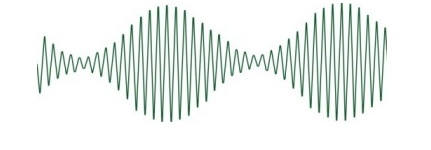
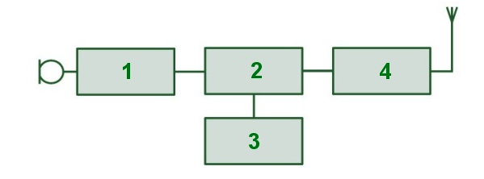
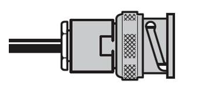

# MOCK TEST 7

## Question 1

What are the three UK Amateur Radio licence levels?

- A. Beginner, Intermediate, Advanced
- B. Foundation, Advanced, Full
- C. Foundation, Intermediate, Full
- D. Technical, General, Extra

## Question 2

Your licence requires you to ensure that your station is clearly identifiable. Which of the following is the recommended practice for giving your callsign?

- A. At least once every 15 minutes
- B. When transmitting on a frequency and as frequently as practicable
- C. At least once per transmission
- D. When transmitting on a new frequency and when leaving a frequency

## Question 3

What is the correct term for a conversation with 3 or more amateurs with whom communication and identification has been established?

- A. A 'Net'
- B. A 'Sked'
- C. A 'CQ'
- D. A 'Group'

## Question 4

Under what circumstances does Ofcom have the right to close down your amateur radio station?

- A. You are in breach of your licence conditions
- B. You have not transmitted in over a year
- C. You operate from a location other than your home address
- D. You use a mode other than voice

## Question 5

Which statement is TRUE for the frequency 0.1357MHz?

- A. You cannot use more than 1 watt erp
- B. You cannot use this frequency for satellite comms
- C. Priority has to be given to other users
- D. The other 3 answers are all true

## Question 6

Restrictions apply for signals radiated over 10 watts EIRP (6.1 watts ERP). Why?

- A. To ensure that members of the public are not exposed to high EMF limits
- B. To prevent interference with other spectrum users
- C. To reduce interference to other countries
- D. To protect the transmitter from damage

## Question 7

Which of the following is NOT an insulator?

- A. Rubber
- B. Ceramic
- C. Glass
- D. Brass

## Question 8

As the wavelength of a transmitted amplitude modulated radio signal increases, what happens to its frequency?

- A. Frequency increases
- B. Frequency decreases
- C. Frequency does not alter
- D. More cycles per second generated

## Question 9

What does the following diagram represent?

- A. An ACD
- B. An ADC
- C. A DCA
- D. A DAC

## Question 10

What is this?

- A. A Continuous Wave (Morse)
- B. A carrier waveform
- C. A modulated waveform
- D. An audio waveform

## Question 11

In the following diagram, what function is performed by Box 3?

- A. RF Power Amplifier
- B. Oscillator
- C. Modulator
- D. Audio Stage

## Question 12

What is the name given to a device designed to recover information sent from one place to another using electromagnetic radiation?

- A. A radio receiver
- B. A modulator
- C. A DAC
- D. An RF Power Amplifier

## Question 13

A long length of co-ax feeder cable may exhibit what?

- A. Gain
- B. Loss
- C. Dummy loads
- D. ERP

## Question 14

An amateur radio antenna will

- A. pick up radio waves and convert them into electrical signals
- B. always require planning permission
- C. work equally well at all frequencies
- D. require an RF earth equal to half the antenna length

## Question 15

What type of connector is this?

- A. BNC
- B. SMA
- C. PL-259
- D. N-Type

## Question 16

Radio waves can be what...?

- A. Refracted
- B. Diffracted
- C. Reflected
- D. All of the above

## Question 17

Which of the following has the least effect on local VHF/UHF radio signals?

- A. Hills
- B. Buildings
- C. Bad weather
- D. Reflected signals from the Ionosphere

## Question 18

Amateur radio signals are least likely to interfere with what?

- A. A microwave oven
- B. A CCTV camera
- C. A wi-fi router
- D. A computer monitor

## Question 19

Which antenna would typically be the most problematic in terms of causing interference?

- A. Dipole
- B. Yagi (beam) antenna
- C. End-fed wire
- D. 1/4 wave groundplane

## Question 20

From an EMC perspective, why might it be useful to keep a log of transmissions?

- A. To prove you are operating within your licence conditions
- B. To have a list of people who can vouch for your contact
- C. In case Ofcom asks to see it during an inspection
- D. To help identify if you may be the cause of interference

## Question 21

What can we tell about the callsign MM7QQQ/P?

- A. The station is operating from a temporary location
- B. This is a UK Full licence holder
- C. The operator is on the Isle of Man
- D. The operator is mobile in Scotland

## Question 22

Why do repeaters need two frequencies?

- A. To allow them to retransmit a received signal in real-time
- B. For ease of radio programming
- C. So that they can hear their own signal
- D. To filter unwanted noise

## Question 23

In which country are you NOT permitted to operate using your Foundation Licence?

- A. Scotland
- B. France
- C. Northern Ireland
- D. Wales

## Question 24

What is the correct wiring for a UK mains plug?

- A. Blue=Live ; Green/Yellow=Neutral ; Brown=Earth
- B. Brown=Live ; Blue=Neutral ; Green/Yellow=Earth
- C. Brown=Live ; Green/Yellow=Neutral ; Blue=Earth
- D. Blue=Live ; Brown=Neutral ; Green/Yellow=Earth

## Question 25

When must eye protection be worn?

- A. To prevent solder or flux from splashing into the eyes
- B. When erecting an antenna
- C. When up a ladder
- D. When adjusting the elements of an antenna whilst it is transmitting

## Question 26

Which of the following statements is FALSE:

- A. Antennas and feeders must be sited away from overhead power cables
- B. Headphones can be dangerous
- C. You should not touch antennas when they are transmitting
- D. Equipment should be earthed to copper central heating pipes
